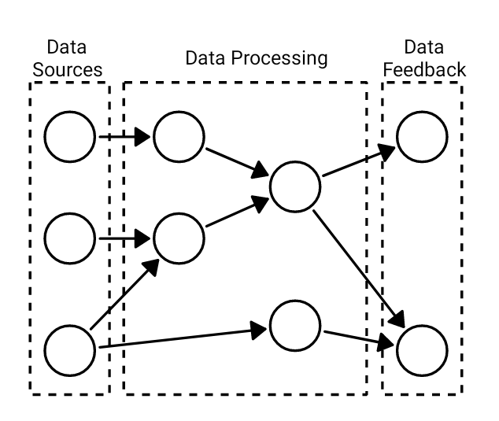

Pipeline Modeling via DAG
#################################

As mentioned in :ref:`Network Typology section<network>`, ChimeraPy uses a peer-to-peer network to represent its data pipeline. To be more precise, ChimeraPy uses a directed acyclic graph (DAG) to model the data pipepline and data streams. The implications of a DAG is that the data streams need to be directed, meaning it must have a source and destination. Acyclic implies that the graph does not permit a cycle.  This is because a cycle in a data pipeline would result in a **disaster**! That is because each :class:`Node<chimerapy.Node>` will only execute once it has at least collected 1 sample from each of its depedencies, therefore a cycle to cause a deadlock.

From our use of ChimeraPy, a DAG can commonly be broken into 3 layers: data sources, data processing, and data feedback. Moreover, the DAG provides us with an explicit representation of the execution schedule, therefore no need of a scheduler.
