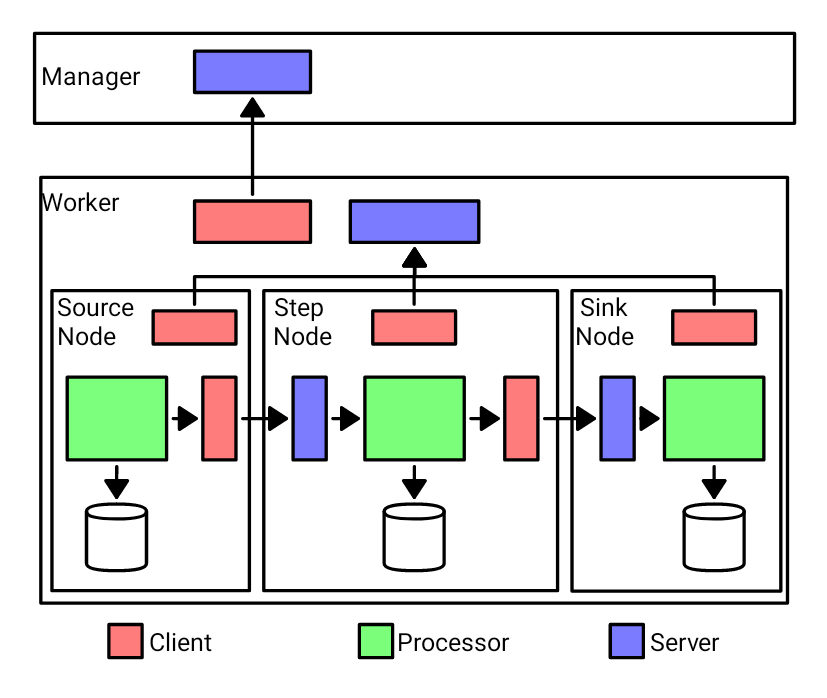

Details on the System's Design
##############################

By stripping the hood of ChimeraPy and see its interworkings, it comes down to socket programming, multiprocessing, and multithreading. Socket programming is used to create generic :class:`Server<chimerapy.Server` and :class:`Client<chimerapy.Client>` that are reused through the system to handle communications between classes across networks and within a computer. In the figure above, you can see how the Manager, Worker, and Node all have Servers and Clients.

Multiprocessing is at the heart of ChimeraPy, as the base class :class:`Node<chimerapy.Node>` is a subclass of Python's build-in multiprocessing's :class:`Process<multiprocessing.Process>`. Each :class:`Node<chimerapy.Node>` executes its ``prep``, ``step``, and ``teardown`` within its own process, to reduce CPU bound limitations.

In the other side of the parallel programming spectrum, multithreading is used to handle IO bounds in ChimeraPy, such as listening for sockets and sending data to other :class:`Nodes<chimerapy.Node>`.

More details in how each component works can be found in the :ref:`Developer's Documentation<developerdocs>`.
