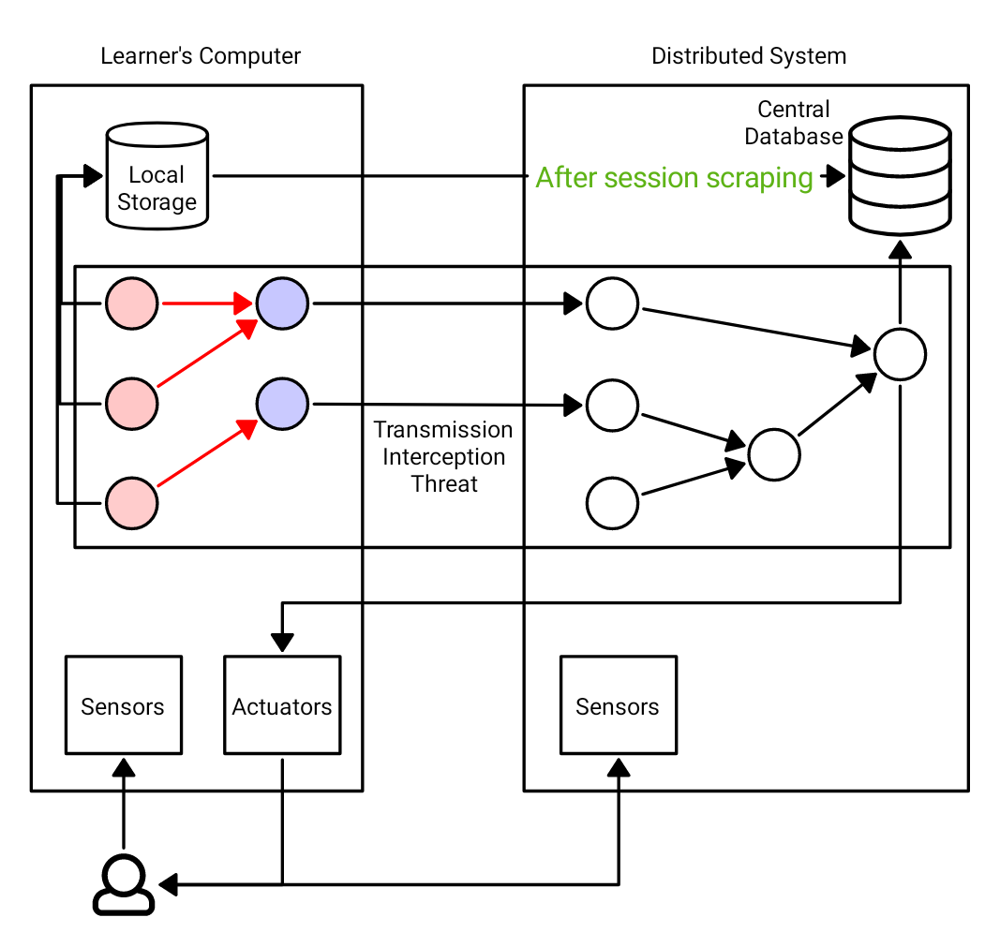

Security and Edge-Computing
###########################

Before diving into deploying ChimeraPy out in the wild, one should consider its affects on people, primarly their safety, security, and privacy. Streaming data that can identify people's identity (such as video and audio) expands the threat surface of ChimeraPy in a significant way. An cyber attacker can perform a man-in-the-middle attack and capture the data during transmission, breaking user's privacy and confidentiality.

It is our goal with ChimeraPy to provide secure methods, such as encryption (currently in development) and session passwords (currently in development), to add security into the system. However, even the design of the DAG and its mapping onto computers can add risks. In the figure above, we should how data collected from a student's computer (ChimeraPy applied to education) can collect identifiable data (red nodes). Instead of directly transmitting this sensitive data through the network with the destination to the cluster, one can apply processing methods to anonymize and hide the student's identity. An example would be of processing webcam videos with emotion prediction and transmit the emotion prediction values instead of the video.
