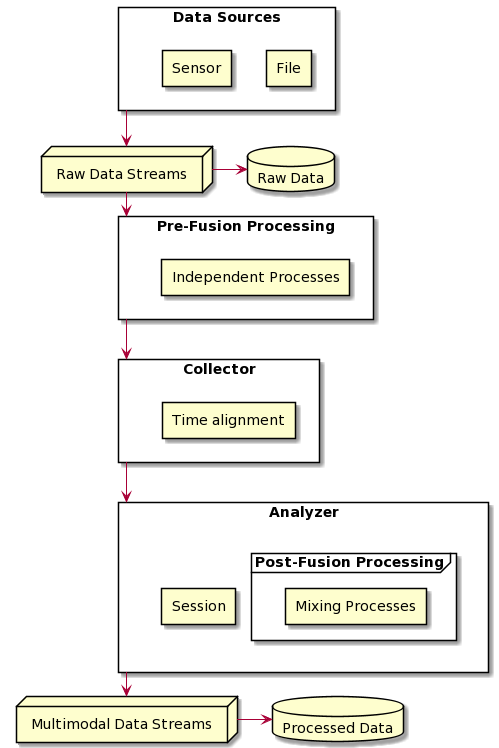

# PyMMDT

Welcome to PyMMDT documentation! The GO-TO spot for easy and modular multimodal analysis and visualization.

## What is PyMMDT?

The objective of PyMMDT library is to make multimodal data collection,
processing, and visualization for both the offline and online setting an 
easier task. Our modular structure helps make this library flexible to 
be molded and shaped to your project's needs.

|  |
|:--:|
| *PyMDDT General Architecture* |

The general architecture is shown above. Its composed of four main components: ``DataStream``, ``Process``, ``Collector``, and ``Analyzer``. Each component will be discussed in further detail in the subsequent subsections. 

## Roadmap

PyMMDT is still under-development, but we hope that with more effort, time and code contributions, PyMMDT becomes an empowering tool for multimodal data collection, processing, and visualization. Below include features that we hope to include soon:

- Create UI tool
- Online PyMMDT implementation
    - Online Collector
    - Online Data Stream
    - Sensor
- Audio subpackage
