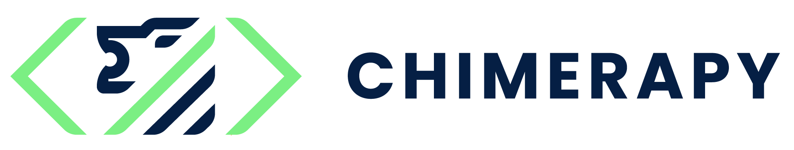

.. chimerapy documentation master file, created by
   sphinx-quickstart on Tue Mar 29 03:41:19 2022.
   You can adapt this file completely to your liking, but it should at least
   contain the root `toctree` directive.

|coverage| |test| |license| |style|

.. |coverage| image:: https://coveralls.io/repos/github/oele-isis-vanderbilt/ChimeraPy/badge.svg?branch=main)
   :alt: coverage

.. |test| image:: https://img.shields.io/github/workflow/status/oele-isis-vanderbilt/ChimeraPy/Test
   :alt: test

.. |license| image:: https://img.shields.io/github/license/oele-isis-vanderbilt/ChimeraPy
   :alt: license

.. |style| image:: https://img.shields.io/badge/style-black-black
   :alt: style

Welcome!
=====================================

We propose the development of ChimeraPy, a distributed computing framework for multimodal data collection. We focus on four key features that are important for multimodal learning analytics purposes: free and open-source code; distributed computing capabilities; the use of python as a programming language; and time-alignment capabilities.

Contents
--------

.. toctree::
   :maxdepth: 3
   :includehidden:

   getting_started
   usage/index

.. toctree::
   :maxdepth: 3
   :includehidden:

   framework/index

.. toctree::
   :maxdepth: 3
   :includehidden:

   api/index

.. toctree::
   :maxdepth: 4
   :includehidden:

   developer/index
   authors

Indices and tables
==================

* :ref:`genindex`
* :ref:`search`
