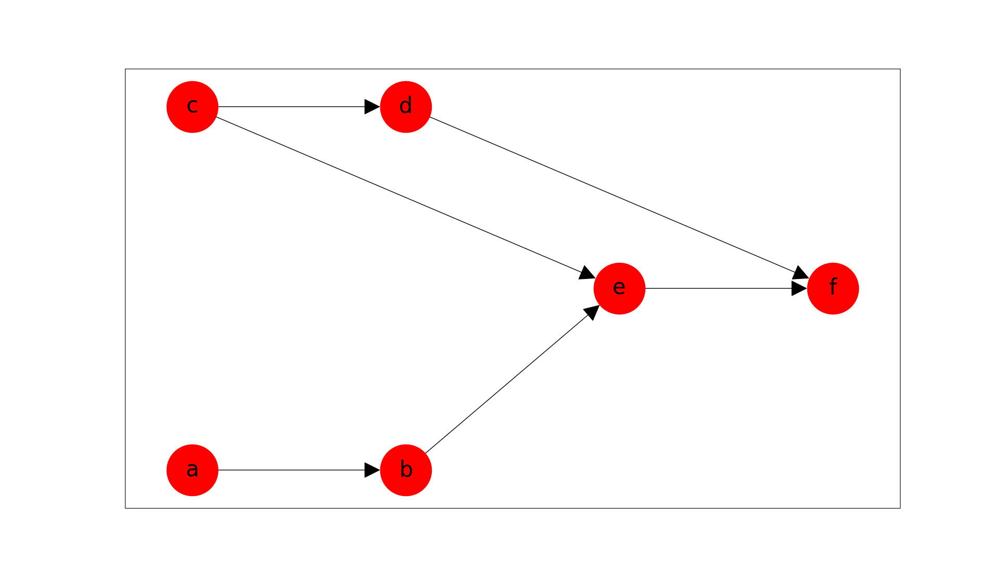

Defining Your Pipeline
######################

When constructing your pipeline, the use of :class:`Node<chimerapy.Node>` and :class:`Graph<chimerapy.Graph>` will largely contribute to the data flow and processing. This is done through the representation of a directed acyclic graph, meaning a graph with edges with a direction that do not make a cycle. If a cycle is detected, then ChimeraPy will not allow you to register the graph. Regardless, there are some visualization tools to help construct a graph.

Instantiate Nodes
*****************

To define you DAG, first create the nodes that will populate the DAG::

    import chimerapy as cp

    a = cp.Node(name="a")
    b = cp.Node(name="b")
    c = cp.Node(name="c")
    d = cp.Node(name="d")
    e = cp.Node(name="e")
    f = cp.Node(name="f")

For now we are just going to use empty :class:`Node<chimerapy.Node>` for illustrative purposes, but in your own implementation, these nodes would include sensor collecting, processing, and feedback.

Add Nodes to Graph
******************

After creating the :class:`Nodes<chimerapy.Node>`, we add them to the :class:`Graph<chimerapy.Graph>`, like this::

    graph = cp.Graph()
    graph.add_nodes_from([a,b,c,d,e,f])
    graph.add_edges_from([[a, b],[c, d], [c, e], [b, e], [d,f], [e,f]])

Handling Frequencies
********************

When defining a pipeline, the sampling frequency of :class:`Nodes<chimerapy.Nodes>` needs to be considered. An example where frequency can cause havoc is when two or more Nodes that feed into a single consumer node have high frequency. To avoid data loss, the consumer node would need to execute its own step function at the summative frequency of all incoming nodes. This would put a large computational burden on the cluster and could lead to system failure. There are counter measures to avoid this issue, by specifying which incoming Node should a consumer Node follow. Following refers to that the consumer Node will only execute its step function when it receives data from the Node that it is following. Effectively the escalating frequency crisis is averted. Declaring followship is shown below::

    hf = HighFrequencyNode(name="hf")
    lf = LowFrequencyNode(name="lf")
    sn = SubsequentNode(name="sn")

    graph = cp.Graph()
    graph.add_nodes_from([hf, lf, sn])

    graph.add_edge(src=hf, dst=sn) # By default
    graph.add_edge(src=lf, dst=sn, follow=True) # <- Overwriting to lf

By default, the first producer node to a consumer is followed, in this case it would be the ``HighFrequencyNode``. To change it, we overwrite this by adding the ``follow`` parameter when adding a edge between a producer and consumer nodes.

Check Graph
***********

With the graph configuration complete, we can visually confirm that the DAG is constructed correctly, by using the following command::

    # Should create a matplotlib figure
    graph.plot()

This creates the following plot:

