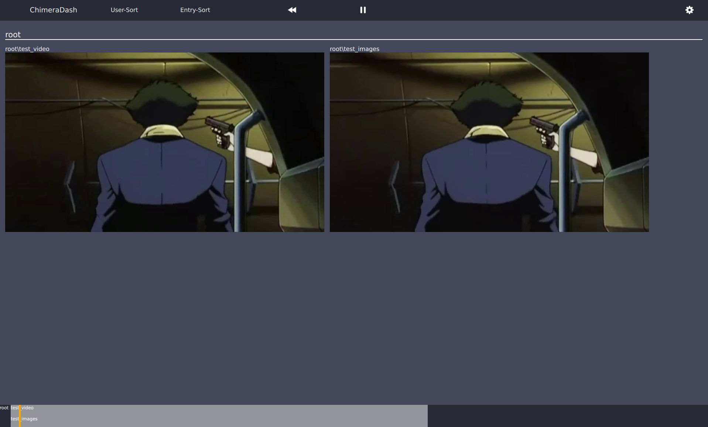

# Introductionary Tutorial

It is recommend that you read the [Basics](./basics.md) first --- as it
elaborates how each component of the library collaborate and 
communicate. Below we provide a simple example. Note that defining a 
pipeline and the data streams is heavily dependent on your data, sensors,
and intended analysis.

The example data can be found in this [public Google Drive folder](https://drive.google.com/drive/folders/1Y1pSOtbvMGgKIuJunuuAx-yzYAFaOWGz?usp=sharing). 
Then perform the following instructions to setup the data.

```python
unzip example_use_case.zip
mkdir data data/output_data
mv example_use_case data data/example_use_case
tree
.
├── data
│   ├── example_use_case
│   │   ├── test.csv
│   │   └── test_video1.mp4
│   └── output_data
│       └── ...
└── main.py
```

All of the code presented below will be placed in ``main.py``.

## The Setup

For any pipeline project, is recommend that you define a set of 
components early on. First, let's start with the imports and constants.

```
import chimerapy as cp
import pandas as pd
import pathlib

RAW_DATA_DIR = pathlib.Path.cwd() / 'data'
OUTPUT_DIR = pathlib.
```

The data streams used in this tutorial include one video and one 
tabular data streams. You can have more or less combinations of 
data streams (only video and tabular data streams supported right now).

```python

# Loading the data
csv_data = pd.read_csv(RAW_DATA_DIR/"example_use_case"/"test.csv")
csv_data['_time_'] = pd.to_timedelta(csv_data['time'], unit="s")

# Create each type of data stream
self.tabular_ds = cp.TabularDataStream(
    name="test_tabular",
    data=csv_data,
    time_column="_time_"
)
self.video_ds = cp.VideoDataStream(
    name="test_video",
    start_time=pd.Timedelta(0),
    video_path=RAW_DATA_DIR/"example_use_case"/"test_video1.mp4",
    fps=30
)

```

After that, it is common to delete the generated logged data if 
rerunning the pipeline (as you debugging during your development). 
Another approach (that is safer) is to name the sessions with a 
timestamp. However, beware that output video files can have a large
memory footprint.

```python

# Clearing out the previous session
experiment_name = 'P01'
experiment_dir = OUTPUT_DIR / experiment_name
if experiment_dir.exists():
    shutil.rmtree(experiment_dir)

```

Finally, it is the step of defining a pipeline. Below is a very
minimal pipeline that purely logs data.

```python

class TestExamplePipeline(cp.Pipeline):
    def step(self, data_samples: Dict[str, Dict[str, pd.DataFrame]]):
        self.session.add_tabular('test_tabular', data_samples['test_tabular'])
        self.session.add_video('test_video', data_samples['test_video'])
        self.session.add_images('test_images', data_samples['test_video'])

# Use a test pipeline
self.individual_pipeline = TestExamplePipeline()

```

Once we have defined and constructed these individual components, we can
feed these to the runners to execute the pipeline.


## Executing the Pipeline through the Runners

There are two main runner types: ``SingleRunner`` and ``GroupRunner``.
As mentioned in the [Basics](./basics.md), these two runners have 
different intended purposes. 

Note: the runners create a directory (logdir / name) to store all the
logged data. The runners take the typical data streams and pipelines, 
but also provide additional customization. More information about each
input parameter can be found in the [API documentation](.source/chimerapy.rst).

```python
# Load construct the first runner
self.runner = cp.SingleRunner(
    logdir=OUTPUT_DIR,
    name='P01',
    data_streams=[self.tabular_ds, self.video_ds],
    pipe=self.individual_pipeline,
    time_window=pd.Timedelta(seconds=0.5),
    run_solo=True,
    memory_limit=0.8
)
```

After constructing the runner, nothing will happen. Only until you `run`
the runner will the loading, processing, and logging of data will start.

```python
# Run the runner with everything set
self.runner.run(verbose=True)
```

An important input parameter to ``run`` is ``verbose``. If debugging 
your pipeline, it is recommended to set ``verbose`` to ``False``. Else,
settings ``verbose`` to ``True`` provides a nice TUI that displays
progress reports.


## Viewing With ChimeraDash

After passing all data through the pipeline and finishing logging, we
can view all the log data through ChimeraDash. Below is the simple 
usage:

```bash
chimerapy --logdir output_data/P01
```

Below is a snapshot of the expected output:


